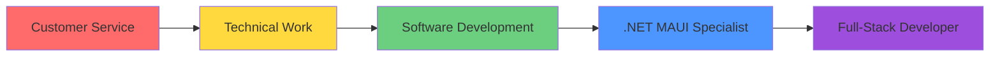

# Hi there, I'm Abdur Rageem Green 👋

<div align="center">
  
[](https://git.io/typing-svg)

</div>

---

## 🚀 About Me

I'm a developer from **Cape Town, South Africa** 🇿🇦, currently pursuing **Multi-Platform Software Development** at the University of the Western Cape. I specialize in building cross-platform applications with .NET MAUI and modern web technologies.

- 🔭 I'm currently working on cross-platform mobile and desktop applications
- 🌱 I'm learning **.NET MAUI**, **Blazor**, and **React**
- ☁️ Exploring **Azure** cloud services and resources
- 💼 Background in customer service and technical work
- 🎯 Goal: Build scalable, user-friendly applications that solve real problems

---

## 🛠️ Tech Stack & Skills

### 💻 Technologies I Work With

<div align="center">


</div>

### 📱 Development Focus

```text
.NET MAUI             ███████████████████░    95%
C#                    ██████████████████░░    90%
Blazor                ████████████████░░░░    80%
React                 ███████████████░░░░░    75%
Azure Resources       ██████████████░░░░░░    70%
```

### ☁️ Azure Knowledge
- Azure App Services
- Azure Storage
- Azure Functions
- Resource Management
- Cloud Deployment

---

## 📊 GitHub Stats

<div align="center">
  


</div>

---

## 🌟 Professional Journey



### 💼 Experience Highlights
- 🍽️ **Customer Service** - Strong communication and people skills from hospitality roles
- 🔧 **Technical Background** - Hands-on experience including mechanical work and welding certifications
- 💻 **Software Development** - Building cross-platform applications with modern Microsoft stack

---

## 🎓 Education & Learning

**📚 Current Studies**
```
🏛️ University of the Western Cape (2025 - Present)
   ├── Multi-Platform Software Development
   └── Digital Impact for Innovation
```

**🎖️ Technical Certifications**
```
🏫 Swift Skills Academy (2022-2023)
   ├── Fire Fighting (NQF Level 2)
   └── Welding (NQF Level 2)
```

---

## 🔧 Current Projects & Focus

<div align="center">

| 📱 Mobile Apps | 🌐 Web Development | ☁️ Cloud Integration |
|:--------------:|:------------------:|:--------------------:|
| .NET MAUI apps for iOS/Android/Windows | Blazor & React web applications | Azure resource management |

</div>

---

## 🌍 Languages

- 🇬🇧 **English** - Fluent
- 🇿🇦 **Afrikaans** - Proficient

---

## 📫 Let's Connect!

<div align="center">

[](mailto:abdurrageemgreen@gmail.com)
[](https://linkedin.com/in/YOUR_LINKEDIN)
[](https://github.com/Abdurrageem)

</div>

---

<div align="center">

### ⚡ Quick Facts About Me

| 🎯 Focused | 🔄 Adaptable | 🚀 Ambitious | 🤝 Collaborative |
|:----------:|:------------:|:------------:|:----------------:|
| Goal-driven developer | Quick learner | Always improving | Team player |

</div>

---

<div align="center">


**Thanks for visiting! Feel free to explore my repositories and reach out for collaborations! 🚀**

</div>

---

<div align="center">
  
</div>
